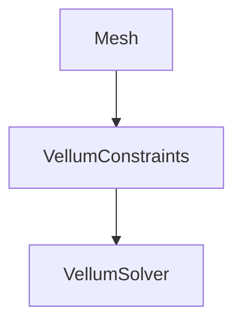
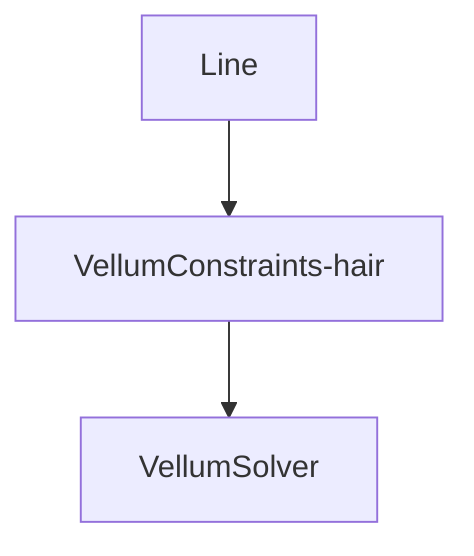

Vellum is a unified solver for softbody dynamics (hair, wire, cloth)

Vellum is similar to Houdini "grains" -PBD (Position based dynamics) - Vellum is a continuation of grains.

>Constraints are similar to *Bullet* constraints and *Internal* constraints.
>
>Stretching, damping, bendability, etc

>Vellum is a successor to *POPs* in many ways

>[!IMPORTANT] It's always recommended to use *Vellum* with a triangulated mesh.

---

# Simple Vellum Setup

Vellum has many different *constraint* types. These all use slightly different mathematics across the graph structure.

![[notes/attachments/Pasted image 20221209170241.png]]

>[!NOTE] Vellum sims *often* require many substeps. around 5
>
>Adding substeps will add multiple calculations per frame which can stiffen the simulation because it's going to calculate the stiffness more times.
>
>To account for this you may need to play around with reducing stiffness

>[!IMPORTANT] If vellum is behaving strangely, one of the first things you should do is visualize the *thickness* of the simulation
>
>![[notes/attachments/Pasted image 20230113145220.png]]
>
>The green spheres represent the thickness that the vellum solver is using to calculate things.

![[notes/attachments/Pasted image 20221214091838.png]]

>[!IMPORTANT] Cloth Thickness
>
>You don't want your cloth to be too thick *or* too thin. It will create strange velocities and artifacts.
>
>Too thick -> If the spheres start to overlap then it will push the verts away from eachother. Might also add strange velocity.
>
>Too thin -> strange behavior, gravity or collisions may break.

Settings you will use *all* the time in vellum are:
1. *Stretch* Stiffness
2. *Bend* Stiffness

![[notes/attachments/Pasted image 20230113145806.png]]

Stretch Stiffness => How hard it is to stretch the constraints apart. Low -> High

## Pinning Vellum

In the *vellum constraints node* there is a *Pin to Animation* section. If you click the cursor you can use the viewport to select the points you want to pin.

![[notes/attachments/Pasted image 20230113151008.png]]

>[!NOTE] Finding the right values
>
>For simulations it can be difficult to find the right values like *Bend Stiffness* for example. The recommended workflow is change by factors of 10 until you are in the right ballpark, then use the smaller increments with the slider.
>
>![[notes/attachments/Pasted image 20230113151919.png]]

### Bend Stiffness

This is somewhat self-explanatory. However you can think of it as different materials. For example a cloth with high bend-stiffness might be rubber, it's hard to fold, even thin pieces. A cloth with low bend-stiffness could be silk.

A nice way to see the effects of *bend-stiffness* the following setup:

![[notes/attachments/Pasted image 20230113155546.png]]

Then we can add some forces. There are two ways to do this.

1. Inside the vellum-solver
2. before the vellum-solver

![[notes/attachments/Pasted image 20230113155625.png]]

>[!IMPORTANT] Preparing Meshes
>
>When doing simulations it's good practice to prepare the mesh. For example if you want to sim the *rubber toy* in houdini you probably want to fuse all the pieces together with a boolean, or vdb, and then remesh it.
>
>![[notes/attachments/Pasted image 20230113161503.png]]
>
>Another thing to keep in mind: You may not want your final geo to be the remeshed geo. Often so you can have your UVs back or something like that.
>
>One solution to that is *Point deforming* the original mesh with the simulated mesh.
>
>![[notes/attachments/Pasted image 20230113161846.png]]

## 3 Different Soft-body types
- Balloon -> Always tried to hold the same amount of volume inside (preserves volume globaly)
	- ![[notes/attachments/baloon1.gif]]
- Struts -> Creates internal constraint geo to act as structural supports. Makes it resist compression.
	- ![[notes/attachments/Pasted image 20230113162444.png]]
- Tet -> considered *regionally* volume preserving. It creates a lattice of triangles on the inside, to calculate what the volume is through the whole shape. Good for objects that are stiffer than balloons. For this you need to remesh and have regularly spaced triangles.

>Struts are fast, but there are sometimes artifacts that have to be fixes. Usually due to the struts in the center that are straight up-and-down

### Balloons

Balloons are made up of cloth around the outside, and a pressure constraint system that runs along the surface and the inside that pushes out from the inside. 

If you make your pressure constraint really stiff it will push outward.

If the cloth is loose the object will keep inflating and become rounder and rounder.

>[!IMPORTANT] Your geo might be fine, but check for creasing or verts too close together if you have artifacts.

## Vellum Strings

If you want to make a string you want to start from a line. Add more length and points.

>[!NOTE] Hair and String are basically the same except that Hair *can* twist and string **CANNOT**

An important value in many sims but especially vellum is *Restlength*.

**Restlength** is the value that holds the original spacing between constraints.

One value we can play with is *Restlength Scale*. 

![[notes/attachments/Pasted image 20230113170519.png]]

This allows us to make adjustments to the original *restlength*.

If we set it to 2, for example, it will take the originally generated *restlength* and multiply it by 2.

If you want to animate this property you have to do a few things.

>[!IMPORTANT] Like most other solvers, attributes set before the solver are only set at the very beginning of the sim by default.

If you want to change constraint properties *during* a simulation, you can use a *vellum constrain properties* node inside the solver.

![[notes/attachments/Pasted image 20230113171104.png]]

You can now add keyframes on the properties inside this node.

### Pinning

Pinning is a way we can attach cloth to objects.

![[notes/attachments/Pasted image 20230120181830.png]]

![[notes/attachments/Pasted image 20230120181903.png]]

In vellum constraints all you need to do is set the pin group and check *match animation*.

# Final Sim

Like with **RBD** we can *Vellum Pack*

![[notes/attachments/Pasted image 20230120182716.png]]

Another Approach is to setup different vellum *sources*.

![[notes/attachments/Pasted image 20230120183818.png]]

In this case you set up different nulls for outputs of each simulation.

Then in another *vellumsolver* add 3 *vellum source* nodes and set up the *geo* and *constraint* fields to the nulls.

![[notes/attachments/Pasted image 20230120184057.png]]

![[notes/attachments/Pasted image 20230120184108.png]]

The nice thing about this method is that you can create groups for 

### DOPnet method

Start out with a simple vellum setup inside the dop.

![[notes/attachments/Pasted image 20230120190455.png]]

Next you will want to source all the vellum objects like before.

![[notes/attachments/Pasted image 20230120190745.png]]

Plug them into input 3 of the vellum solver.

![[notes/attachments/Pasted image 20230120191732.png]]

![[notes/attachments/Pasted image 20230120191859.png]]
In DOPs the *objects* hold the simulation data.

### Vellum Post-Process

