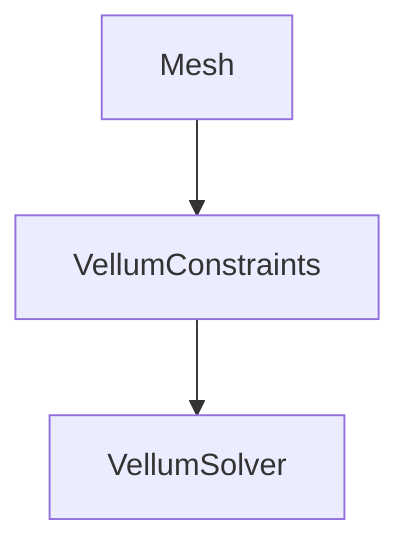

Vellum is a unified solver for softbody dynamics (hair, wire, cloth)

Vellum is similar to Houdini "grains" -PBD (Position based dynamics) - Vellum is a continuation of grains.

>Constraints are similar to *Bullet* constraints and *Internal* constraints.
>
>Stretching, damping, bendability, etc

>Vellum is a successor to *POPs* in many ways

>[!IMPORTANT] It's always recommended to use *Vellum* with a triangulated mesh.

---

# Simple Vellum Setup

>[!NOTE] Before a mesh can

Vellum has many different *constraint* types. These all use slightly different mathematics across the graph structure.

![[notes/attachments/Pasted image 20221209170241.png]]

>[!NOTE] Vellum sims *often* require many substeps. around 5
>
>Adding substeps will add multiple calculations per frame which can stiffen the simulation because it's going to calculate the stiffness more times.

>[!IMPORTANT] If vellum is behaving strangely, one of the first things you should do is visualize the *thickness* of the simulation

![[notes/attachments/Pasted image 20221214091838.png]]

>[!IMPORTANT] You don't want your cloth to be too thick. It will create strange velocities and artifacts.

---

