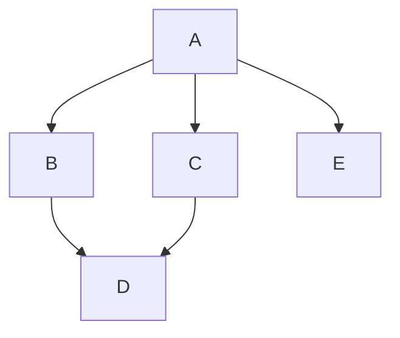

- blender preferences

### Topo assignment

- Common Issues
	- edge flow conversions
		- ngons
		- laminate-faces
		- > What methods did you use?
	- smooth bevel
		- ngons
	- **Apply topo**
		- many didn't even attempt
		- couldn't apply exercises from before to connect geometry
		- was is miscommunication on my end?
		- was it unclear?
	- ! **Fixing Meshes**
		- Almost everyone didn't do it
		- was it unclear?
		- was the mesh check addon not clear on how to use?
		- many people didn't even try fixing bevel artifacts
		- or attempted to fix normals

---
A recap on fixing meshes and edge flow

---

### UV assignment check-in
- how are people feeling?
- do we need more time
- is there clarification people need?

---
## Final Project
For the final project you will be modeling surfacing a non-trivial prop and putting in context of 2D animated shot. Try and push yourself, and have fun!

---
To complete the project in the next several weeks we will work on our models.
The lessons for each week will often coincide with where you should be at with your project.

---
There will be additional grades during certain checkpoints of your project
For example (I need to nail these down still...)
1. Final model
2. Surfacing
3. Rendering
4. Compositing

---

### Requirements
1. Mesh mush be Subd compatible
2. All mesh problems must be cleaned up
3. Must be UV'd
	1. UVs should be clean
4. Topology should be mostly quads
5. Main mesh pieces should be watertight
6. Use as few parts as possible
7. Freeze transforms and have local transforms make sense
8. No non-manifold polygons
9. Normals should make sense
10. No normal artifacts

---

### Proposal
The proposal will include a document and video of you walking through the proposal.

#### Proposal Requirements
1.  Turn in a single page PDF document
2. The document should have a description of the model you want to make
	1. sketches or example images should be included
	2. the model should be a hero object
		1. important prop
		2. vehicle
		3. part of the environment
4. A description of the context
	- film
	- shot
	- still
5. A description of the art direction of the final image
	1. with example images
6. A description of your personal goals with this project

