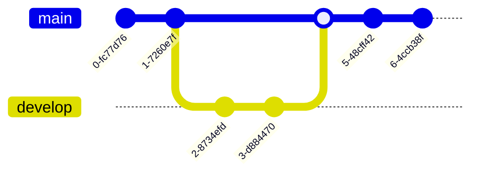

In git one of the most powerful things is the possibilities for working collaboratively.

This can be achieved with with a few features built into git.

Here are a few examples of Git commands that are commonly used for branching and merging:

1.  Creating a new branch:

`git branch new-feature`

This command creates a new branch called "new-feature" that you can switch to and start working on.

2.  Switching to a branch:

`git checkout new-feature`

This command switches the working directory to the "new-feature" branch, allowing you to make changes to it.

3.  Merging changes from a branch:

`git merge new-feature`

This command merges the changes made on the "new-feature" branch into the current branch.

4.  Resolving conflicts:

`git status`

This command will show you which files have conflicts, and you will need to manually edit the files to resolve the conflicts.

`git add file.txt`

This command stages the changes you have made to the conflicted file.

`git commit -m "resolved conflicts"`

This command will commit the changes to the repository.

5.  Deleting a branch:

`git branch -d new-feature`

This command deletes the "new-feature" branch after it is no longer needed.

It's important to note that these are just a few examples and Git has many more commands and options that can be used for branching and merging. It's recommended to read the Git documentation or take a course to get more familiar with Git.

